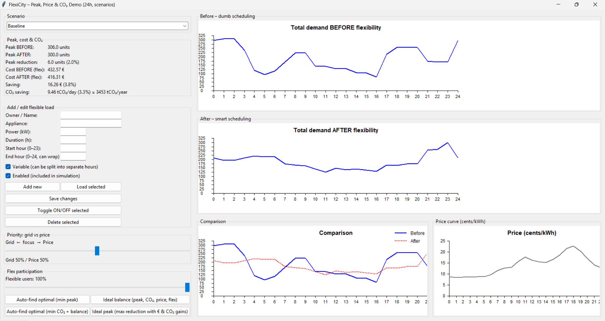

# PeakShift Helsinki – Energy Peak Simulator

**Urban Circular Hack Helsinki 2025** — Helsinki, Finland  

---

## Why PeakShift Helsinki?

Every evening around **7 pm**, Helsinki sees a **sharp electricity spike**. Everyone plugs in EVs, turns on heating, cooks dinner, and runs appliances at the same time. This drives up prices, strains the grid, and can force the city to spend **€2 billion+ on upgrades** over 5–7 years.  

**PeakShift Helsinki** shows how **smart scheduling of flexible devices** can flatten the peak, saving money, cutting CO₂, and easing city infrastructure pressure.  

---

## Key Impact

| Benefit | Result |
|---------|--------|
| **User Savings** | Up to **€16+ per day** |
| **CO₂ Reduction** | Up to **3,400+ tCO₂/year** |
| **City Grid** | Delay/avoid **€2 billion+ upgrades** |

---

## How It Works

- **Before:** Default scheduling — devices run according to typical habits  
- **After:** Smart scheduling — flexible devices shift to off-peak hours  

**Adjustable sliders:**  
- Flex participation (how many devices shift)  
- Grid vs Price optimization  

**Scenarios:** Baseline, Winter, 2030 Future  

---

## Screenshot

  

The top graph shows the peak. The bottom shows flattened demand after smart scheduling.

---
## Python + tkinter (standard library only)
License
## MIT — free to use and modify

## Run the Simulator

**Requirements:** Python 3.8+  

```bash
git clone https://github.com/KSou799/Urban-Circular-Hack-Helsinki-2025-Helsinki-Finland.git
cd Urban-Circular-Hack-Helsinki-2025-Helsinki-Finland
python Hackathon_energy.py

